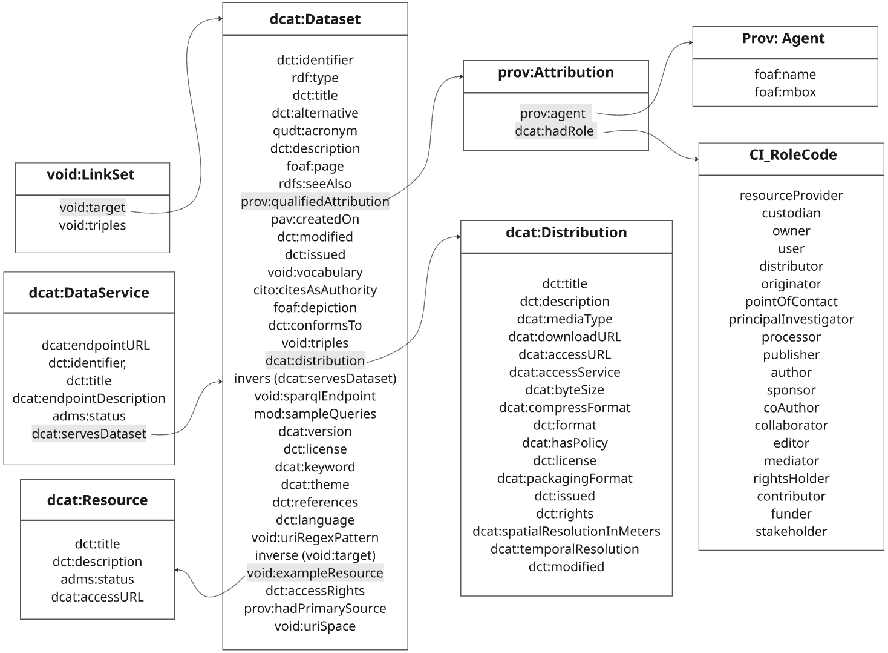

# Knowledge Graph Metadata Entry Tools Usability Study Introduction and Instructions

# Table of Contents
- [Motivation](#motivation)
- [What Is a Knowledge Graph?](#what-is-a-knowledge-graph)
- [Metadata](#metadata)
- [Metadata Specification You Will Use](#metadata-specification-you-will-use)
- [Writing Metadata in Turtle Format](#writing-metadata-in-turtle-format)
- [Your Tasks in This Study](#your-tasks-in-this-study)
  - [Tool A – Turtle Editor](#tool-A--turtle-editor)
  - [Tool B – Form Interface](#tool-B--form-interface)
  - [Tool C – LLM-Assisted Form](#tool-C--llm-assisted-form)
  - [After Completing the Tasks](#after-completing-the-tasks)
- [Why Your Participation Matters](#why-your-participation-matters)
- [Voluntary Participation](#voluntary-participation)
- [Confidentiality and Data Protection](#confidentiality-and-data-protection)


## Motivation

Data surrounds us every day. Scientists, cities, and companies all collect data (e.g. about weather, traffic, books, or research).  
But before we can use any of this data for experiments, analysis, or machine learning, we have to **find it** and **understand what it contains**.  
Sometimes that is harder than it sounds. Many datasets are shared online with very little explanation. Without knowing who made them, what they describe, or whether we can reuse them, they remain hidden and unused.

---

## What Is a Knowledge Graph?

A **knowledge graph** is a specific type of dataset that stores information as connections between things.
Each piece of information is a small fact that links one thing to another.

Look at the example below:

<p align="center">
  
</p>

In this graph:

Leonardo da Vinci painted The Mona Lisa.

The Mona Lisa is located in the Louvre Museum.

Leonardo da Vinci was born on April 15, 1452, and is an Artist.

Each arrow represents a relationship between two things, forming a network of linked facts.
When many of these small connections come together, they create a web of knowledge that computers can also understand and search.

So, a knowledge graph is simply a way to organize data as relationships, not just as rows and columns. It helps both humans and machines explore how pieces of information are related.

---

## Metadata

To make a dataset useful, we need to describe it clearly. This description is called **metadata**.  
Metadata tells others the **title**, **creator**, **language**, **keywords**, and **purpose** of the dataset.  
For knowledge graphs, it can also include special details such as example queries or links to related data. The complete list of these elements are listed and describes in Knowledge graph metadata specification.

> Good metadata helps others and even search engines discover and reuse datasets.  
> Without it, valuable work can be lost or overlooked.

---

## Metadata Specification You Will Use

For this study you will receive a specification that lists the elements we expect you to fill. Think of it as a checklist. It keeps everyone consistent and makes the descriptions machine readable. The **metadata specification** lists all the elements you need to describe for each knowledge graph (such as title, description, creator, keywords, and access rights). 

Below is a sample of five fields from the metadata specification, showing how each element is defined, its expected data type, its purpose, and an example from Wikidata.

You can access the full KG metadata specification [here on Google Sheets](https://docs.google.com/spreadsheets/d/1pC6Hj6wl-uzyFeBmK19f_UaQyuUN4-DQ/edit?gid=945024402#gid=945024402).


<h3>Metadata Specification (Excerpt)</h3>

<table style="width:80%; font-size:88%; margin:auto; border-collapse:collapse;">
<thead>
<tr>
<th style="border-bottom:1px solid #ccc; padding:6px;">Field</th>
<th style="border-bottom:1px solid #ccc; padding:6px;">Value Specification</th>
<th style="border-bottom:1px solid #ccc; padding:6px;">Purpose / Use</th>
<th style="border-bottom:1px solid #ccc; padding:6px;">Wikidata Metadata Example</th>
</tr>
</thead>
<tbody>
<tr>
<td style="padding:6px;"><b>Identifier</b></td>
<td style="padding:6px;"><code>rdfs:Literal</code> or <code>IRI</code></td>
<td style="padding:6px;">A unique identifier for the dataset.</td>
<td style="padding:6px;"><code>wd:Q2013</code></td>
</tr>
<tr>
<td style="padding:6px;"><b>Title</b></td>
<td style="padding:6px;"><code>rdf:LangString</code> or <code>xsd:string</code></td>
<td style="padding:6px;">The main name of the dataset or knowledge graph.</td>
<td style="padding:6px;"><code>"Wikidata Knowledge Base"</code></td>
</tr>
<tr>
<td style="padding:6px;"><b>Description</b></td>
<td style="padding:6px;"><code>rdf:LangString</code> or <code>xsd:string</code></td>
<td style="padding:6px;">Provides a short explanation of the dataset content and scope.</td>
<td style="padding:6px;"><code>"A free and open knowledge base that can be read and edited by humans and machines."</code></td>
</tr>
<tr>
<td style="padding:6px;"><b>Theme / Category</b></td>
<td style="padding:6px;"><code>IRI</code></td>
<td style="padding:6px;">Specifies the topical area or classification of the dataset.</td>
<td style="padding:6px;"><code>&lt;http://www.wikidata.org/entity/Q21198&gt;</code> (Ontology)</td>
</tr>
<tr>
<td style="padding:6px;"><b>Distribution Information</b></td>
<td style="padding:6px;">
  <code>dcat:Distribution</code><br>
  (includes sub-elements:<br>
  &nbsp;&nbsp;<i>title</i><br>
  &nbsp;&nbsp;<i>description</i><br>
  &nbsp;&nbsp;<i>mediaType</i><br>
  &nbsp;&nbsp;<i>downloadURL</i><br>
  &nbsp;&nbsp;<i>accessURL</i>)
</td>
<td style="padding:6px;">Describes how and where the dataset is made available.</td>
<td style="padding:6px;">
  title: “Wikidata dump files”;<br>
  mediaType: “application/gzip”;<br>
  downloadURL: 
  <a href="https://dumps.wikimedia.org/wikidatawiki/entities/">
    https://dumps.wikimedia.org/wikidatawiki/entities/
  </a>
</td>
</tr>
</tbody>
</table>

---

*Note:* The schema specifies which elements are **required** and which are **optional**, and defines the **expected value type** for each.  
For instance, a title is free text, a theme is an IRI, a date follows a standard date format, and a distribution includes structured subfields like *mediaType*, *downloadURL*, and *accessURL*.

*Note:* The “optional” and “required” indicators on this form apply only to the final version of the tool. For the purposes of this user study, please disregard them and complete as many fields as you are able to.

Look at the example below:

<p align="center">
  
</p>

## Writing Metadata in Turtle Format
### Please note: You are not required to know Turtle for this study.

Metadata for knowledge graphs is often written using a simple, structured data language called **Turtle**.  
It expresses information as short statements that both humans and computers can read, such as:

```turtle
@prefix ex: <http://example.org/> .

ex:HarryPotter a ex:Book ;
    ex:title "Harry Potter and the Sorcerer’s Stone" ;
    ex:author "J.K. Rowling" .
```

This means:  
“Harry Potter is a book. Its title is *Harry Potter and the Sorcerer’s Stone*. Its author is *J.K. Rowling*.”

Writing in Turtle makes metadata **machine-readable**, so other systems can automatically find and understand datasets.

If you are new to Turtle, we have prepared a short introduction to help you understand the basics.  
You can read it [here](https://github.com/marmhm/KG-metadata-tool-usability-study/blob/main/turtle_introduction.md).

---

## Your Tasks in This Study

You will first sign a consent form, then complete a short background questionnaire. After that, you will perform three main tasks and complete post-task questionnaires, followed by one comparative questionnaire. In these tasks, you will work with **three different tools**  to describe three knowledge graphs (KGs).

We provide you with:
- **Three short documents** written in natural language. Each one describes a different knowledge graph and includes all the information needed to create its metadata.  
- **A metadata specification** (schema) that lists the elements you should describe, such as title, description, keywords, languages, creator, access rights, and other KG-specific details like example queries or linked resources.

You will use the three tools to transform the same information from the natural language document into a **machine-readable format** (Turtle).  
Each tool lets you do this in a different way.

---

### Tool A – Turtle Editor

This tool provides a **text editor** with Turtle syntax validation.  
Here, you will manually create the metadata in Turtle format.

**Steps:**
1. Skim the KG documentation to understand what it describes.  
2. Open the metadata schema checklist and note which elements you must include.  
3. Gather exact values, such as IRIs for themes, sources, and linked resources when available.  
4. Map each element from the schema to a simple Turtle statement, keeping the format short and consistent.  
5. Use the editor’s validation to check that your Turtle is syntactically correct.

*Example screenshot of Tool 1:*
<p align="center">
  
</p>

---

### Tool B – Form Interface

In this tool, you will describe a KG using a **web form**.  
You do not need to write any Turtle syntax — the form automatically converts your answers into structered format.

**Steps:**
1. Skim the KG documentation.  
2. Fill in the field values according to the metadata specification.  

*Example screenshot of Tool 2:*
<p align="center">
  
</p>


---

### Tool C – LLM-Assisted Form

The third tool uses **AI assistance** to help you fill the metadata form.  
You will upload the natural-language KG document, and the tool will generate **AI suggestions** for each metadata field.

**Steps:**
1. Upload the KG documentation.  
2. Click on each metadata field to view the AI suggestions.  
3. Review the suggestions, and if you accept the sugesstion add them. If you dont accept some of the suggesstions you can reject them. 

*Example screenshot of Tool 3:*
<p align="center">
  
</p>


---

### After Completing the Tasks

After trying each tool, you will complete a short questionnaire about usability and acceptence of the tool.

You will be asked how easy each tool was to use, how helpful it felt, and what could be improved.  

Your feedback will help us understand which approach makes metadata creation most efficient and user-friendly.


---

## Why Your Participation Matters

Your feedback will help us understand how users perceive, use, and benefit from each tool and to what extent each tool is helpful in metadata curation. 

> Thank you for being part of this study.  

## Voluntary Participation

Your participation is completely voluntary. You may withdraw at any time without providing a reason. If you withdraw, your data will not be used. We assume that you will bring your laptop with you.


## Confidentiality and Data Protection

Your data will be treated with strict confidentiality. On the day of the study, you will recieve a participant code (e.g., P01, P02) which will be used instead of your name. All files (task outputs, timing logs, questionnaire responses) will only carry this code. Your consent form, which contains your name, will be stored securely and separately from the research data and it is only accessible by Principal investigator. The research dataset will therefore contain no direct identifiers. In accordance with GDPR, you have the right to withdraw your data from the study at any time without giving a reason and without any consequences. If you choose to withdraw, you can send an email to study coordinator, and he will delete your research data immediately.

Data Collection
We will collect task performance data (time, completion, accuracy), questionnaire responses, and participants background information. Particularly, we will collect the following data during the study:
 - Task outputs: metadata files in Turtle or JSON format ( 3 files per participant, ~30 files total for 10 participants ).
 - Task performance logs: automatically recorded start and end times.
 - Questionnaire responses: pre-study background survey, three post-task questionnaires, and one final comparative questionnaire ( ~5 files ).

